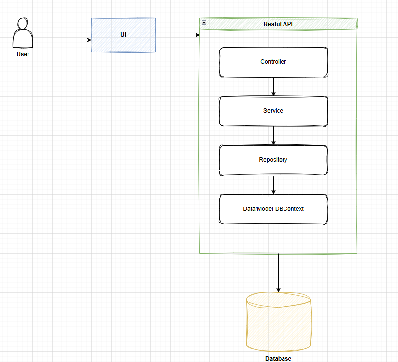
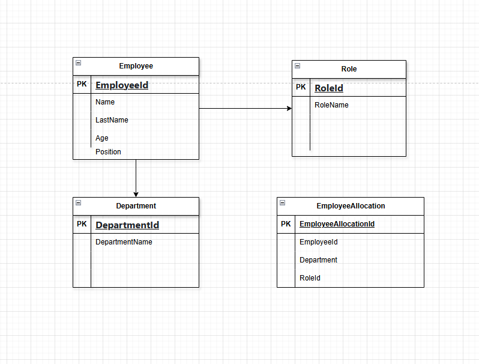

# Employee Management API

<div align="center">
  <h1>
   # Employee Management API
  </h1>
  <p>   
   The Employee Management API is a service that provides CRUD operations for managing employees, roles, and departments within an organization. Built with ASP.NET Core and Entity Framework Core, this project serves as a robust backend for HR systems, admin dashboards, or any business scenario where employee data needs to be managed and queried efficiently.
  </p>
</div>

## Key Features

- **Employee CRUD:** Add, update, delete, and retrieve employees.
- **Role Management:** Manage roles and associate them with employees.
- **Department Management:** Organize employees into departments and manage department data.
- **RESTful API:** Exposes endpoints for all core operations.
- **EF Core Database:** Uses Entity Framework Core for data persistence.
- **Repository Pattern:** Clean separation of business logic and data access.

## Project Structure

- **Models:** Defines core entities such as Employee, Department, and Role.
- **Data Access:** Contains the `EmployeeDbContext` class for interacting with the database using Entity Framework Core.
- **Repositories:** Implements repositories for data operations (e.g., `EmployeeRepository`, `RoleRepository`, `DepartmentRepository`).
- **Controllers:** RESTful API controllers for handling HTTP requests and responses.
- **Tests:** Unit and integration tests for core repository and business logic.

## Getting Started

### Prerequisites

- [.NET 6.0 SDK](https://dotnet.microsoft.com/download/dotnet/6.0)
- SQL Server (or another supported SQL database)
- Visual Studio, VS Code, or another preferred IDE

### Setup

1. **Clone the repository:**
    ```sh
    git clone https://github.com/Zizwemkz/KingPriceAssessment.git
    ```

2. **Restore NuGet packages:**
    ```sh
    dotnet restore
    ```

3. **Configure your connection string:**
   - Open `appsettings.json`
   - Update the `ConnectionStrings` section with your database details.

### Entity Framework Core: Creating a New Database

If you are setting up the project for the first time or need to create a new database schema, follow these steps:

1. **Add the Initial Migration:**
    ```sh
    dotnet ef migrations add InitialCreate
    ```

2. **Apply the Migration to Create the Database:**
    ```sh
    dotnet ef database update
    ```

> **Note:** Ensure you have the [EF Core CLI tools](https://learn.microsoft.com/en-us/ef/core/cli/dotnet) installed:
> ```
> dotnet tool install --global dotnet-ef
> ```

### Building the Project

To build the project, run:
```sh
dotnet build
```

### Running the API

To launch the API locally:
```sh
dotnet run
```
The API will be available at `https://localhost:44317/swagger/index.html`

### Running Tests
To run the CoinDispenser project T1 tests
To run all tests:
```sh
dotnet test
```

## Design
## High Level Architecture Diagrme can be found here: 
</a>

## Class Diagrame:
</a>


## Component Descriptions

- **End User / UI**

- **API Layer**
  - **Controller:** Handles HTTP requests from the UI, validates input, and delegates to the service layer.
  - **Service:** Contains business logic and orchestrates operations between controllers and repositories.
  - **Repository:** Handles data access logic, communicates with the DbContext for CRUD operations on the database.
  - **DbContext:** Manages entity objects during runtime, bridges the domain classes and the database.

- **Database**
  - Relational database that persists all application data (e.g., employees, roles, departments).

## Flow

1. **End User** interacts with the **UI**.
2. The **UI** sends HTTP requests to the **API Controller**.
3. The **Controller** calls the **Service** for business logic.
4. The **Service** accesses the **Repository** for data operations.
5. The **Repository** uses the **DbContext** to interact with the **Database**.
6. Responses are returned back up the chain to the **End User**.
